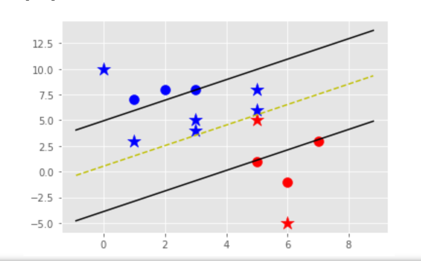

# machine-learning-algorithm


<!-- ABOUT THE PROJECT -->

## 实验说明

​        本次实验实现了SVM算法，并且提供了两种实现方式，第一种是通过枚举参数的思想，不断趋近原数学模型的最优解。第二种是采用由约翰·普莱特于1998年发明的SMO算法来求解SVM对偶问题的解。在本次实验过程中我们从数学模型出发，采用python编程，从最朴素的求解方法到利用数学结论衍生出的优化算法，感受到了在机器学习算法中，数学思想对于算法优化有着举足轻重的作用。


### 相关库

本节应列出用于引导项目的所有主要框架/库。将任何附加组件/插件留在确认部分。这里有几个例子。

* python 3.9
* numpy  1.22.4
* matplotlib 3.5.1    
* jupyter notebook   


<!-- GETTING STARTED -->

## 开始

_这是一个示例，说明如何在本地设置项目。要获取本地副本并运行，请遵循以下简单的示例步骤。_
### 准备

_这是一个如何列出使用软件所需的内容以及如何安装它们的示例。_
* python （3.9）
  ```sh
  下载地址：https://www.python.org/
  ```

* pip 
  ```sh
  pip install numpy
  ```
  ```sh
  pip install matplotlib
  ```

### 初始化

_下面是一个示例，说明如何指导观众安装和设置应用程序。此模板不依赖任何外部依赖项或服务。_

1. 克隆项目
   ```sh
   git clone https://github.com/zhanggzh/machine-learning-algorithm.git
   ```
2. 初始化环境
   ```sh
   pip install numpy
   ```
     ```sh
   pip install matplotlib
     ```
3. 启动
   ```js
   python svm.py;
   ```


<!-- USAGE EXAMPLES -->
## 结果示例

1. 朴素法求解结果



2. SMO算法求解结果

KQDXVY%65S8H.png)


